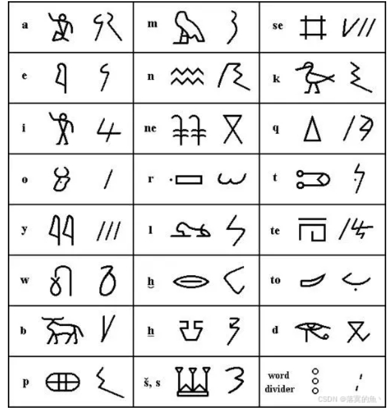
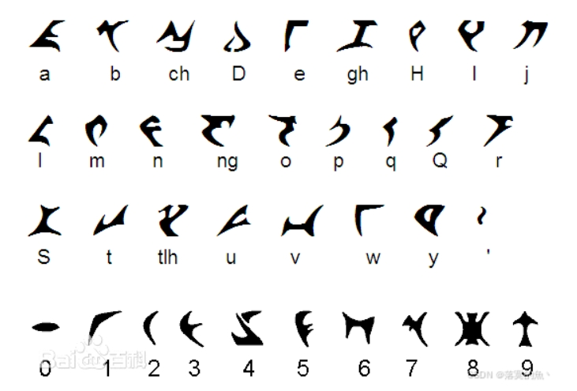
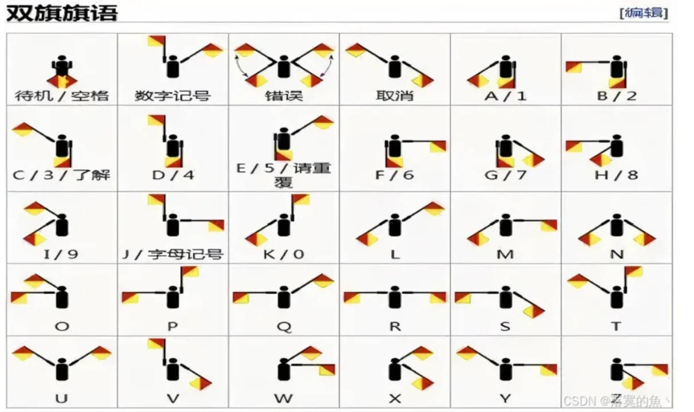

# Misc

[TOC]

## Kali（Linux系统）

### **[1.extundelete](http://extundelete.sourceforge.net/)**

```bash
# 在linux上挂载光盘的命令

mkdir /mnt/disk
mount attachment.img /mnt/disk/
cd /mnt/disk 

#可以使用 eog 图片名 命令来查看图片

#使用结束后用 
umount: /mnt/disk 
#命令取消挂载
```

```bash
extundelete --restore-all attachment.img
# 数据恢复成功后会生成一个 RECOVERED_FILES 文件
```

### 2.压缩包套娃

```bash
while [ "find . -type f -name '*.tar.xz' | wc -l" -gt 0 ]; do find -type f -name "*.tar.xz" -exec tar xf '{}' \; -exec rm -- '{}' \;; done;
```

```bash
strings flag 查找flag字符
```

## Traffic（流量）

1. SMTP
2. 

## Code（编码）

#### 猪圈密码：


- **多类变种**


- #### 圣堂武士密码（猪圈密码的变种）：


#### 小猫密码：


#### 五笔密码：


#### 提瓦特大陆：


#### 古埃及象形文字：



#### 外星人密码：


#### 克林贡语密码《星际迷航》：



#### 元素周期表：


#### 狄德拉字符(暗精灵活神)：


#### 银河字母(游戏《指挥官基恩》)：


#### 跳舞的小人：


#### 旗语密码：



